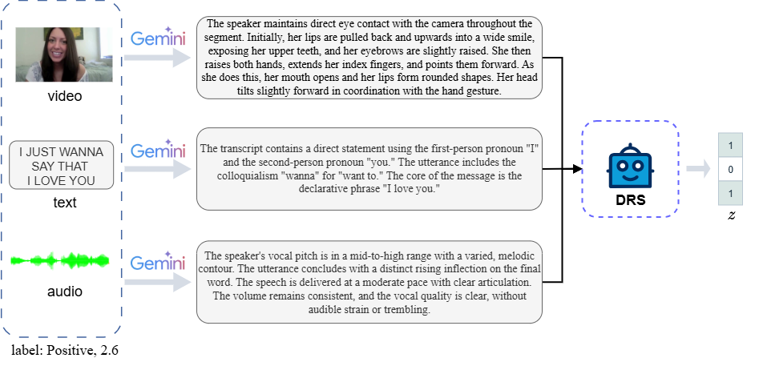

### Case Study

We provide a representative case study, as illustrated in Figure 1.

#### Case Study Analysis

The selection vector **[1, 0, 1]** indicates that only the **textual** and **visual** rationales are adopted, while the **audio** modality is excluded.  
Specifically, the textual content *“I love you”* delivers strong semantic cues, and the visual signal *“wide smile”* conveys clear emotional evidence. In contrast, the audio modality lacks explicit emotional indicators in this instance, contributing limited additional information. Consequently, incorporating audio introduces redundancy rather than improving sentiment prediction, making text and vision the most informative modalities for this case.

---

### Supplementary Experiments

**Table 1** presents supplementary experimental results on the **CMU-MOSI** dataset, comparing SAFE with different prompt and backbone model variants.

| Model / Setting | ACC-2 | F1 | ACC-7 | MAE | Corr |
|-----------------|-------|----|-------|-----|------|
| SAFE w/ Prompt Variant | 86.28 | 86.21 | 47.38 | 0.712 | 0.797 |
| SAFE w/ Qwen-Omni-Turbo | 85.98 | 85.94 | 46.50 | 0.699 | 0.798 |
| Gemini-2.5-Pro | 86.06 | 85.99 | 43.92 | 0.791 | 0.772 |
| **SAFE (Ours)** | **86.43** | **86.45** | **49.13** | **0.683** | **0.803** |

All experiments are conducted on the **CMU-MOSI** benchmark.

---

### Efficiency Comparison with SLM Baselines

We further compare the computational efficiency of SAFE with a representative SLM-based baseline (**DLF**). The results are summarized in **Table 2**.

| Model | Trainable Parameters | Training Time | GPU Memory Usage |
|-------|----------------------|---------------|------------------|
| SAFE | 115M | 10 min | 8 GB |
| DLF | 112.4M | 5 min | 4.5 GB |

Compared to DLF, SAFE incurs moderately higher training time and memory consumption due to the use of **two BERT encoders**. All efficiency comparisons are performed on the **CMU-MOSI** dataset.
